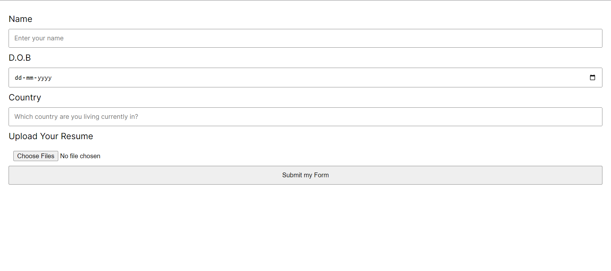
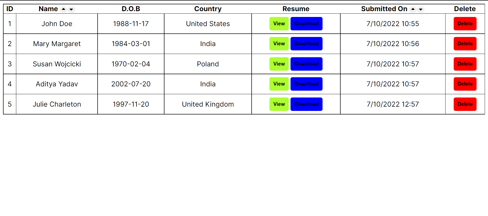

# Resume Uploader and Viewer using vanilla NodeJS

##Implemented Features:

1. **Form** for the candidates to submit their name, date of birth, country and **upload** their **resume** in pdf format.

   
   
2. **List** all the received form **submissions** in a table with the following features:
   a. **Sort** the list by **name** (alphabetically) and **submissionTime**
   b. **View** each Resume file PDF in browser or **download** the **PDF** file.
   
   

##API ROUTES

**GET** /countries

- returns a list of all countries with their respective country codes.

**GET** /listings

- returns a list of all form submissions received until now.

**GET** /listings/fieldName/orderBy

- returns a list of all the form submissions in which the field specified by _fieldName_ is sorted in ascending or descending order depeding on _orderBy_ (ASC, DESC)

**POST** /uploadData

- submit and save form data to database and redirect to view submissions page.

**DELETE** /deleteListing/id

- delete listing specified by _id_ in the database
